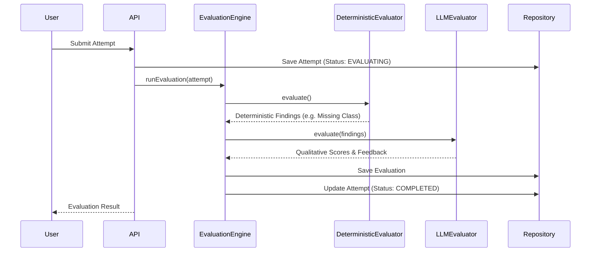

# Architecture

## Layers
1. **UI Layer** (`app/`, `components/`): Next.js App Router. Renders the interactive workspace and feedback dashboards.
2. **API Layer** (`app/api/`): Next.js Route Handlers. Exposes endpoints for submissions and evaluations.
3. **Application Services** (`domain/.../Service.ts`): Orchestrates domain logic (e.g., creating attempts, running evaluations).
4. **Domain Layer** (`domain/`): Core business models (`Problem`, `Attempt`, `Evaluation`).
5. **Infrastructure Layer** (`lib/prisma.ts`, `domain/.../Repository.ts`): Handles data persistence and mapping to domain models.

## Evaluation Flow

## Major Classes & Extension Points
- **`EvaluationEngine`**: The core orchestrator. Currently hardcodes the deterministic and LLM evaluators, but could accept a list of `Evaluator` implementations via dependency injection.
- **`Evaluator` Interface**: The primary extension point. Any new evaluation strategy (e.g., AST parsing, peer review) just needs to implement `evaluate(): Promise<EvaluatorResult>`.
- **Repositories**: Abstract away the database schema. Prisma limitations (like JSON parsing for SQLite) are handled entirely within the Repositories, so the Service and Domain layers remain pure.
